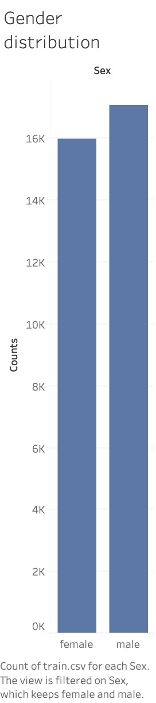

# Dog and cats image classification
Convolutional neural networks using DNN to classify images between dogs and cats

## Model comparison
| Algorithm Name/ Metric Name | AUC           |
| --------------------------- | ------------- |
| VGG16                       | 77.232        | 
| Inception                   | 67.00         | 
| VGG19                       | 48.85         | 
| Efficient net 6*            | 87.3          |

 *Efficinet net has been used with label smoothing of 0.05

## Project brief
* This project is been taken as [kaggle competition](https://www.kaggle.com/c/siim-isic-melanoma-classification) for melannoma image classification challange. 

### Dataset Description
* This dataset has more than 33,000 images as trainning dataset and more than 10,000 images as test dataset. Dataset was hugely imbalanced. The samples with positive dataset was extremely less and negative as majority samples.

## Project flow
* In this project the TPU is extremely utilised and parallel training. The dataset was hosted on Google cloud dataset and due to that TPU can be utilised. Here is [link]() for TPU and how it can be utilised in colab. Data directly used from GCS using GCS path.
* After that there is numerous data augmentation things has been done like roatation, shear, zoom, horizontal flip, brightness and zue. Augmentation is very important in the case of this idea. After doing this there are almost 12 times different augmentation and due to that every epoch we trained on this augmented dataset. Using speciaized tennsorflow model creation function we can train more than 1 models in parallel. As 8 TPU threads are available we are training 8 models in parallell.

## Data visualization
* **Age distribution of samples**

* **Class distribution of samples**

* **Gender distribution of samples**

* **Diagnosis distribution of samples**

## Built with
* Python
* Matplotlib
* Seaborn
* Pandas
* Tensorflow
* Keras
* GPU implementation
* CV2
* Colab
* Xception
* EfficientNet
* glob, math

## Authors
* [Yash Choksi](https://www.linkedin.com/in/choksiyash/)

## Acknowledgements
* [Data set URL](https://www.kaggle.com/c/quora-insincere-questions-classification)
* [Book referred](https://www.amazon.com/Hands-Machine-Learning-Scikit-Learn-TensorFlow/dp/1491962291)
